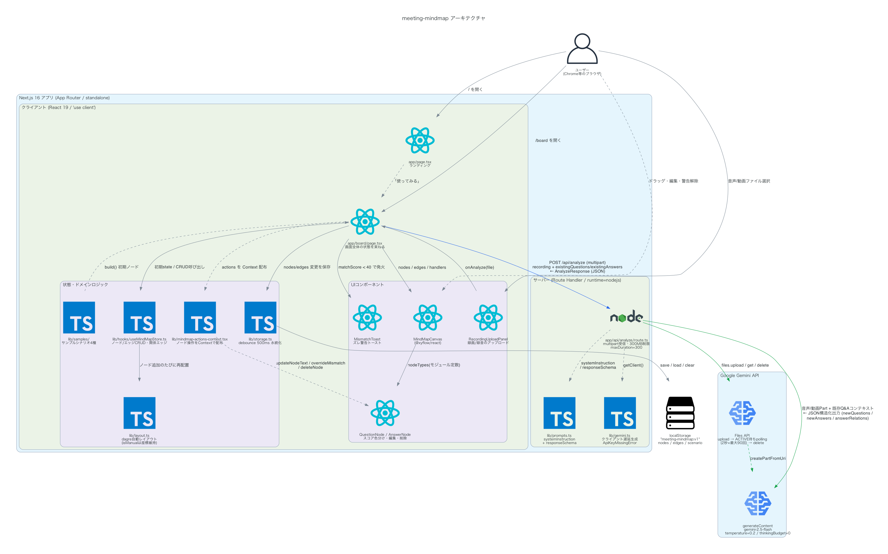

# meeting-mindmap

会議の録画・録音データをアップロードすると、質問と回答をマインドマップ状のホワイトボードに自動で組み立ててくれるアプリ。

「言いたいこと」と「答えたこと」が本当に噛み合っているのかを可視化し、会議のすれ違いをなくすことを目的にしている。

## できること

### 1. 録画データからマインドマップを自動生成

会議の録画・録音ファイル(音声/動画)をアップロードすると、Geminiが全体を文字起こしした上で解析する。質問は中央のノードとして、回答はその質問から枝分かれするノードとして自動配置される。要領を得ない・回りくどい発言はAIが論点を保ったまま簡潔な文章に要約して表示する(元の発言はホバーで確認できる)。

### 2. 質問と回答の噛み合い度を判定

回答ノードには質問に対する「マッチ度」(0〜100点)が表示され、噛み合っていない回答には赤枠と警告トーストでリアルタイムに知らせる。曖昧・はぐらかし・論点のすり替えなどをその場で検知できる。

### 3. 回答同士の一致・対立を可視化

同じ質問に複数の回答がぶら下がっている場合、それらが同じ結論を支持しているのか、対立しているのかをAIが判定し、緑の実線(🤝 一致)・赤の破線(⚡ 対立)のエッジで結んで表示する。誰と誰の意見が噛み合っていて、どこで割れているのかが一目でわかる。

### 4. 手動での調整・編集

ノードはドラッグで自由に配置でき、ダブルクリックでテキストを編集できる。誤検知した警告は「妥当な回答として扱う」で解除でき、未分類の発言は手動でドラッグ接続して質問に紐づけられる。

### 5. サンプルシナリオ

録画データのアップロードなしでもすぐに動作を確認できるよう、4つのサンプルシナリオを用意している。

- 予算会議(架空):総予算→割り振り→公布日と議論が発展していくデモ
- 愛知県議会 質疑(実データ):令和7年6月定例会の会議録を要約引用
- 学生討論会(実データ):YouTube動画を要約・パラフレーズ
- ひろゆき×DaiGo討論(実データ):同上

いずれも出典がある場合はUI上にリンクを表示する(著作権配慮のため、原文の逐語引用ではなく要約・パラフレーズしたテキストのみを使用)。

## アーキテクチャ

## 技術構成

- Next.js 16(App Router)+ React 19 + TypeScript + Tailwind CSS 4
- `@xyflow/react`(react-flow)によるマインドマップ描画 + `dagre`による自動レイアウト
- Gemini API(`gemini-2.5-flash`)による音声/動画の理解・文字起こし・質問回答抽出・要約・マッチ度判定・一致対立判定
- データ保存はブラウザの`localStorage`のみ(サーバー側DBなし)

## セットアップ・開発

開発環境のセットアップ、ディレクトリ構成、設計上のポイントは [CONTRIBUTING.md](CONTRIBUTING.md) を参照。

## デプロイ

本番環境へのデプロイ手順(Firebase App Hosting / Docker)は [DEPLOY.md](DEPLOY.md) を参照。

## 将来構想

### その他の拡張方向(優先度は上記より低い)

- **Zoom/Google Meet等の会議アプリとのリアルタイム連携**(Bot参加による音声キャプチャ、Webhook経由の文字起こし取得など)。ブラウザマイク入力より実装難度が高く、各プラットフォームのBot API/認可フローへの対応が必要
- **Miro / Google Slides / Microsoft Whiteboard等の外部ツールへのエクスポート連携**(作成したマインドマップをそれぞれのAPI形式に変換して書き出す)
- **公私(ビジネス会議 / 公共機関の議事録)の両方で使えるようにするための調整**:用途ごとのプロンプトチューニング(口語的なビジネス会議 vs フォーマルな議会答弁)や、アクセス権限・公開範囲の考慮

## 制約・注意事項

- 録画・録音ファイルはGemini Files API経由でアップロード・処理される。大きなファイルは処理に数十秒〜数分かかる場合がある(サイズ上限は現状300MB程度を想定)
- データは`localStorage`のみに保存されるため、複数人・複数端末での共有はできない
- `GEMINI_API_KEY`未設定でもアプリ自体(ランディング・サンプルシナリオ表示)は動作するが、録画データの解析(`/api/analyze`)は全てエラーになる
